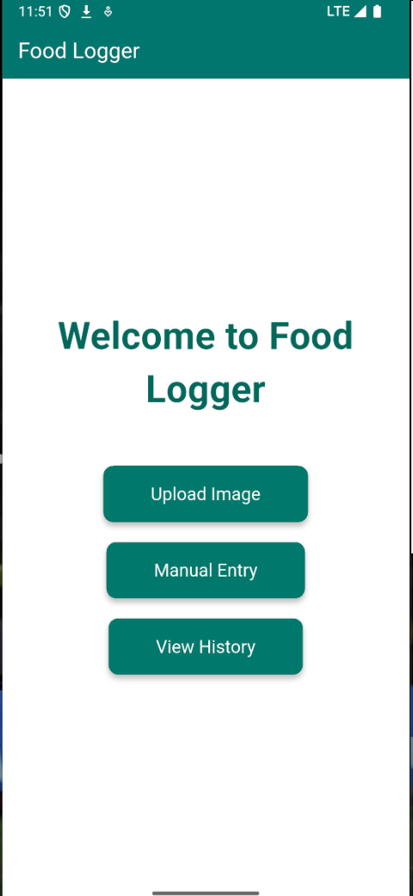
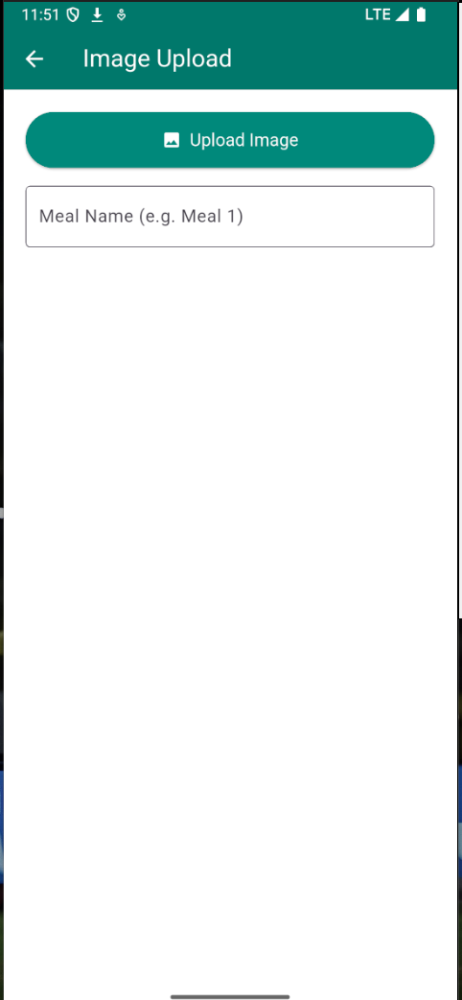
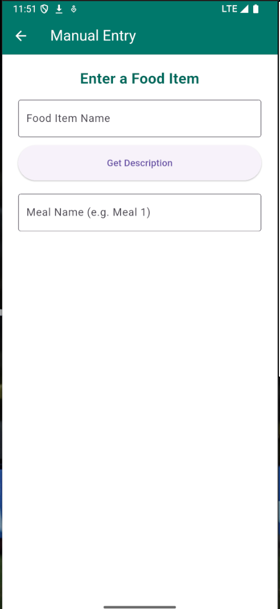
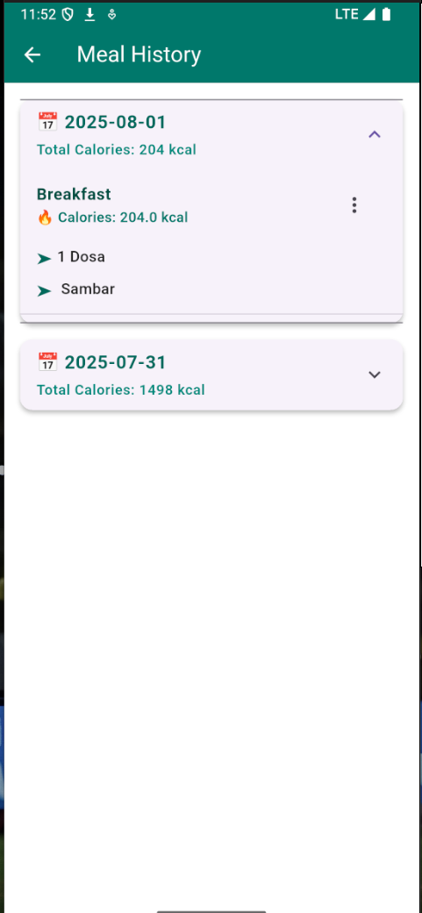

# 🍱 Food Logger App

A Flutter-based mobile app to **track daily meals and calories**. Users can **upload meal images** for AI-based food detection or **manually enter food items** to get detailed nutritional info. All data is stored in **Firebase Firestore** and can be viewed as a history of meals per day.

---

## 📸 Features

- Upload images of meals for AI food recognition
- Get nutrition and calorie info via generative AI
- Manual food entry support
- Delete individual food items or full meals
- Daily meal history with calorie breakdown
- Firebase integration for storage and sync

---

## 💻 Tech Stack

- **Flutter** – Cross-platform mobile app development

---

## 🔧 Tools & Services Used

- **YOLOv8** – For food object detection in uploaded images (custom trained)
- **Render** – To deploy Python Fast APIs for detection and nutrition description.
- **Together.ai** – Used for AI-generated nutrition descriptions
- **Firebase Firestore** – Stores user meals, calories, and history

---
## 📸 Screenshots

<table>
  <tr>
    <td align="center"><strong>Home Page</strong></td>
    <td align="center"><strong>Upload Image</strong></td>
  </tr>
  <tr>
    <td></td>
    <td></td>
  </tr>
  <tr>
    <td align="center"><strong>Manual Entry</strong></td>
    <td align="center"><strong>History Page</strong></td>
  </tr>
  <tr>
    <td></td>
    <td></td>
  </tr>
</table>


---
## How to Run

Clone the repo then,
   ```bash
   cd food_logger
   flutter pub get
   flutter run
